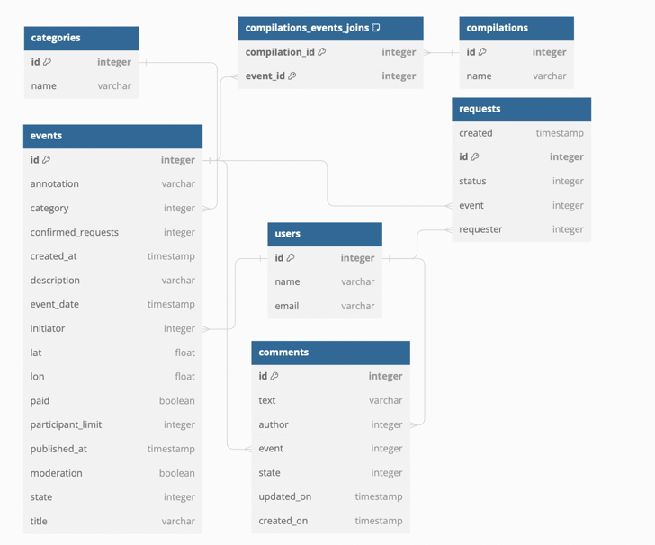

# java-explore-with-me
Двухмодульное приложение состоит из основного сервиса и сервиса статистики просмотров (а также двух БД для основного и для сервиса статистики).

Приложение представляет собой афишу. В которой можно предложить какое-либо событие от выставки до похода в кино и собрать компанию для участия в нём.
Сервис статистики хранит количество просмотров для анализа работы приложения
Функционал основного сервиса различается в зависимости от роли (публичная, закрытая, административная)

[ссылка на mr](https://github.com/sandra2593/java-explore-with-me/pull/5)

Диаграмма базы данных

